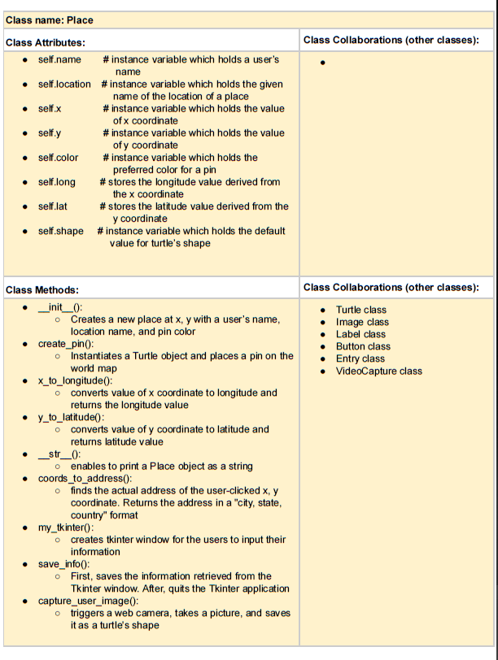

# _Project Name:_ Going Places

## Description

The project is closely related to geography. It aims to provide users 
with an interactive world map. The map will appear with pins on 5 locations around 
the world that are 
significant for me. After, the users will be able to place their own pins or 
instead their photos.

The code was written in Python utilizing the following libraries:
_turtle, reverse_geocoder, cv2, imageio, PIL, tkinter, tkinter.ttk, time, datetime_

## User Instructions

The following is an explanation of how you could use my program:

My program consists of a text file that stores information about five places in the world. 
When the program is run, a world map will pop up and the program will place pins on the world map according to the information provided in the text file. 
Then, user will be able to click anywhere on the map in order to create his/her own place. 
The click will trigger a Tkinter window, which will ask users for their name, preferred color, and an option to take their picture (selfie). 
After clicking “Save” on the window, the given information will be processed. 
The program will perform reverse geocoding and find out the actual name of the location where the mouse was clicked on the world map. 
After, the program will place a pin (if the user took a picture then the picture would replace the default pin) and label it with user’s name and location. 
Meanwhile, in order to terminate the program, user should press the “q” key.

## References

Resources that I utilized while developing the project:

1. I used the following online source in order to learn how to use a web camera to take
pictures in python.
URL to the source: https://stackoverflow.com/questions/34588464/python-how-to-capture-image-from-webcam-on-click-using-opencv/34588758

2. Used the following to get help in converting PNG image to GIF file.
URL to the source: https://www.quora.com/How-do-I-create-a-GIF-file-from-a-bunch-of-JPEG-files-using-Python

3. Learned all Tkinter functionalities from the following source.
URL to the source: https://likegeeks.com/python-gui-examples-tkinter-tutorial/

## Additional

Following is the CRC (Class-responsibility-collaboration) card for the project:

